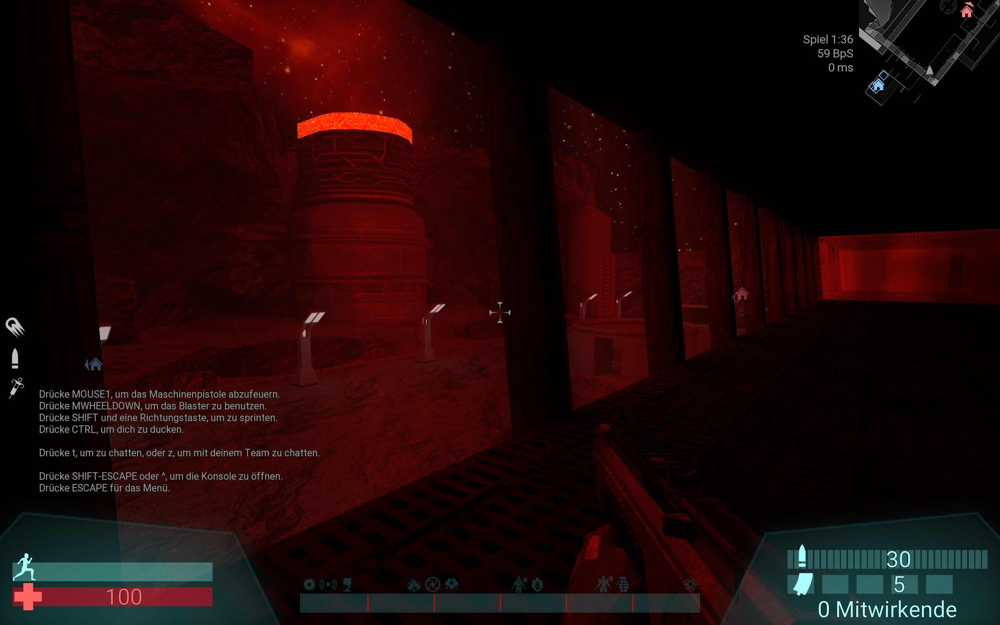
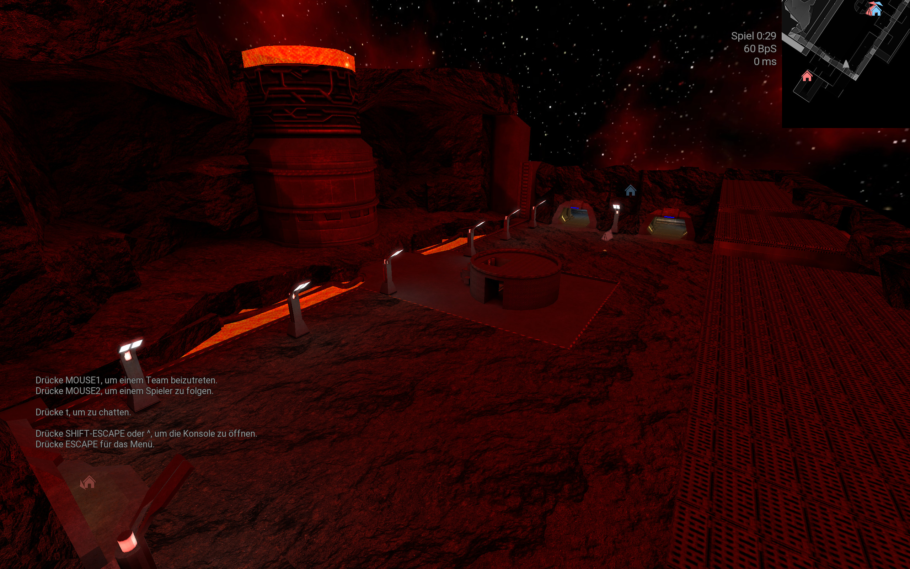
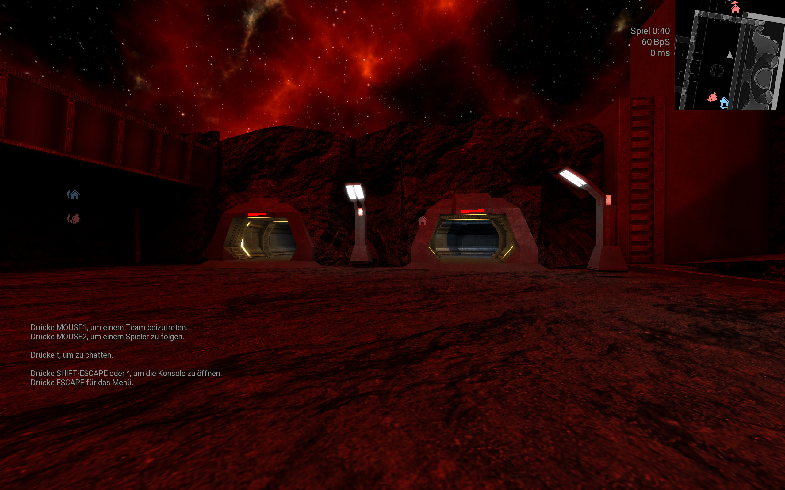
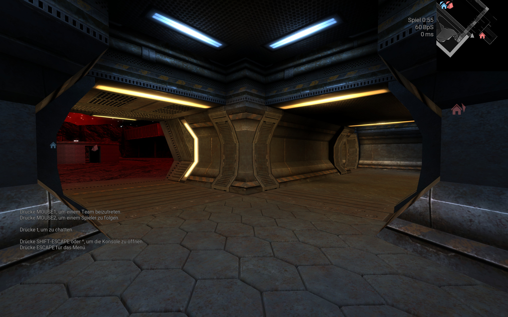

DooM, by Grise.[LBF] for Unvanquished.
 
## Credits
 
Map: DooM
Author: Grise
License: MIT
 
Textures:
- Unvanquished game
See Unvanquished files for licenses.
- Doom Dark Textures Mod v1.1 by Doomenator.
Textures by Doomenator, 111jani111.

Copyright / Permissions: You may use/edit this files for any use you see fit, if you give all credits.
and for the doom 3D textures,
thanks for the great work to Wulfen, Monoxead, Sikkpin, Clear_strelok, Arl, darklord34, snapshot_, warezeater, Dafama2k7

---

Additional updates: 06.01.2024

Author: Masmblr 

Changelog: 
- Brushwork improvements 
- Hidden surfaces now use caulk shaders 
- "no-struc-brushes" changed to detail-brushes 
- Added lava texture & shader (lava texture source: https://opengameart.org/content/yet-another-glowing-coal-pattern) 
- Added new textures
- Added a new section at middle part containing two lava pits and a big reactor inside rocks

Screenshots:

---

Additional updates: 07.01.2024

Author: Masmblr 

Changelog: 
- Brushwork improvements 
- Replaced entries with more detailed ones, reshape of the middle part

Screenshots:

